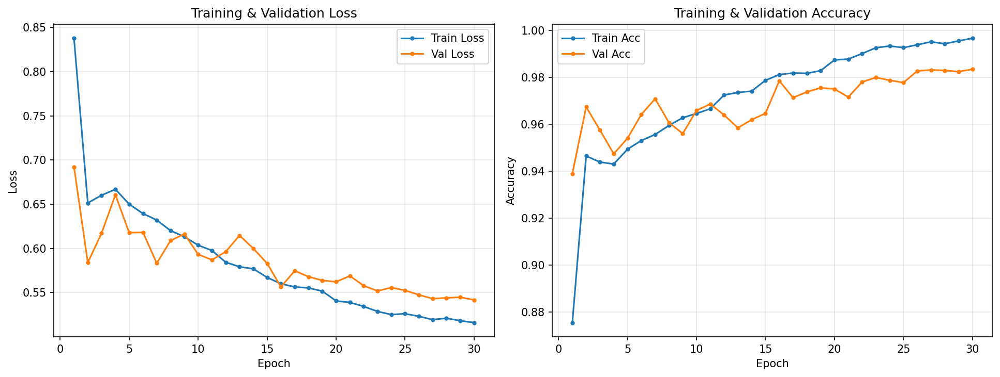
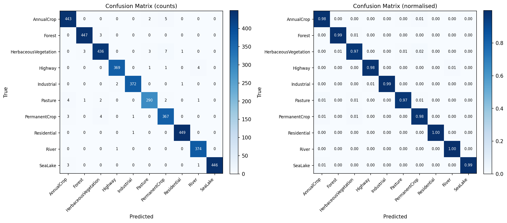
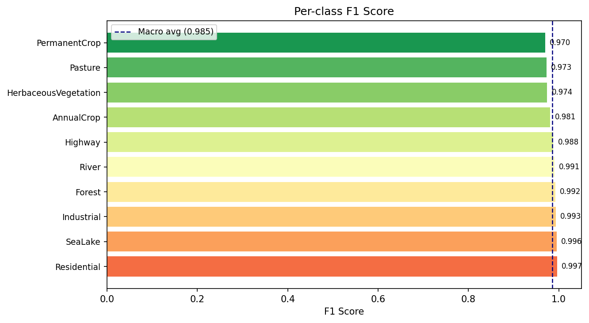

# EuroSAT Land-Use Classification

EuroSAT dataset classification using deep learning models on Kaggle.  Runs locally or directly on **Kaggle** with a
free GPU in under 25 minutes.

---

## Project Overview

This project trains a CNN/ViT classifier to identify 10 land-use / land-cover
categories from 64×64 RGB satellite patches (EuroSAT dataset).

### Key features

| Feature | Details |
|---|---|
| Dataset | EuroSAT RGB — 27,000 images, 10 classes |
| Default model | EfficientNet-B0 (pretrained ImageNet) via `timm` |
| Alternative models | ResNet-50, ViT-S/16, ConvNeXt-T, Swin-T — one config change |
| Transfer learning | ImageNet pretrained backbone + custom head |
| Mixed precision | `torch.cuda.amp` — ~2× faster on GPU |
| Reproducibility | Fixed seeds, deterministic cuDNN |
| Config system | YAML + CLI overrides |
| Resume training | Full checkpoint restore (model + optimizer + scheduler) |
| Logging | Timestamped console + rotating file log |
| Metrics | Accuracy, Macro F1, Weighted F1, per-class F1, confusion matrix |
| Visualisations | Training curves, confusion matrix, per-class F1 chart |
| Kaggle-ready | See `KAGGLE_GUIDE.md` for step-by-step instructions |

---

## Dataset

**EuroSAT** is a benchmark dataset for land-use classification derived from
Sentinel-2 satellite imagery.

| Property | Value |
|---|---|
| Source | Sentinel-2 (ESA Copernicus) |
| Images | 27,000 |
| Size | 64 × 64 pixels, RGB |
| Classes | 10 |
| Images per class | 2,000–3,000 |

### Classes

| # | Class | Description |
|---|---|---|
| 0 | AnnualCrop | Cultivated land with annual crops |
| 1 | Forest | Dense tree coverage |
| 2 | HerbaceousVegetation | Low-level vegetation (grasslands, shrubs) |
| 3 | Highway | Major road infrastructure |
| 4 | Industrial | Factories, warehouses, urban industrial zones |
| 5 | Pasture | Open grassland used for livestock |
| 6 | PermanentCrop | Vineyards, orchards, permanent agriculture |
| 7 | Residential | Urban/suburban residential areas |
| 8 | River | Natural rivers and waterways |
| 9 | SeaLake | Open water bodies (sea, lakes) |

**Kaggle dataset:** [apollo2506/eurosat-dataset](https://www.kaggle.com/datasets/apollo2506/eurosat-dataset)

---

## Model Architecture

Default: **EfficientNet-B0** with a custom 2-layer head.

```
Input (3 × 224 × 224)
    └─► EfficientNet-B0 backbone (pretrained ImageNet)
            └─► Global Average Pooling → [1280]
                    └─► BatchNorm1d → Dropout(0.3) → Linear(1280 → 10)
                            └─► Logits [10 classes]
```

The backbone is from the `timm` library and is interchangeable — any timm model
can be specified in the config with zero code changes.

---

## Results

Results on the **test split** (15% of 27,000 images = 4,050 samples),
trained for 30 epochs.

| Model | Test Accuracy | F1 Macro | F1 Weighted | Training Time |
|---|---|---|---|---|
| EfficientNet-B0 (default) | **98.59%** | **0.9855** | **0.9859** | — |
| ResNet-50 | — | — | — | — |
| ViT-Small/16 | — | — | — | — |
| ConvNeXt-Tiny | — | — | — | — |

*Results for models other than EfficientNet-B0 are pending.*

### Per-class F1 (EfficientNet-B0)

| Class | Precision | Recall | F1 Score | Support |
|---|---|---|---|---|
| Residential | 0.9956 | 0.9978 | **0.9967** | 450 |
| SeaLake | 1.0000 | 0.9911 | **0.9955** | 450 |
| Industrial | 0.9947 | 0.9920 | **0.9933** | 375 |
| River | 0.9842 | 0.9973 | **0.9907** | 375 |
| Forest | 0.9911 | 0.9933 | **0.9922** | 450 |
| Highway | 0.9919 | 0.9840 | **0.9880** | 375 |
| AnnualCrop | 0.9779 | 0.9844 | **0.9812** | 450 |
| HerbaceousVegetation | 0.9798 | 0.9689 | **0.9743** | 450 |
| Pasture | 0.9797 | 0.9667 | **0.9732** | 300 |
| PermanentCrop | 0.9607 | 0.9787 | **0.9696** | 375 |

### Training Curves



### Confusion Matrix



### Per-class F1 Chart



---

## Project Structure

```
kaggle-ml-project/
│
├── src/
│   ├── datasets/
│   │   └── eurosat.py          # Dataset class, transforms, DataLoader factory
│   ├── models/
│   │   └── model.py            # timm model factory, checkpoint save/load
│   ├── training/
│   │   └── trainer.py          # Training + validation loop, LR schedule
│   ├── evaluation/
│   │   └── evaluator.py        # Metrics, confusion matrix, plots
│   └── utils/
│       ├── config.py           # YAML config with dot-notation + CLI overrides
│       ├── seed.py             # Reproducibility seed helper
│       └── logging_utils.py    # Logging setup
│
├── configs/
│   └── config.yaml             # All hyperparameters — single source of truth
│
├── scripts/
│   ├── train.py                # Training entry point
│   └── evaluate.py             # Standalone evaluation entry point
│
├── notebooks/
│   └── kaggle_notebook.ipynb   # Ready-to-run Kaggle notebook
│
├── requirements.txt
├── README.md
└── KAGGLE_GUIDE.md             # Step-by-step Kaggle usage guide
```

---

## How to Run Locally

### Prerequisites

- Python 3.10+
- NVIDIA GPU recommended (CPU works but is slow)
- ~5 GB disk space (dataset + model)

### 1. Clone / download the project

```bash
cd "To/The/Project/Directory"
```

### 2. Create a virtual environment

```bash
python -m venv .venv

# Windows:
.venv\Scripts\activate

# Linux / macOS:
source .venv/bin/activate
```

### 3. Install dependencies

```bash
pip install -r requirements.txt
```

> **PyTorch with CUDA:** The `requirements.txt` installs the CPU build of PyTorch
> by default.  For GPU support, install manually first:
> ```bash
> # CUDA 11.8:
> pip install torch torchvision --index-url https://download.pytorch.org/whl/cu118
> # CUDA 12.1:
> pip install torch torchvision --index-url https://download.pytorch.org/whl/cu121
> ```

### 4. Download the EuroSAT dataset

#### Option A — Kaggle API (recommended)

```bash
# Install the Kaggle CLI
pip install kaggle

# Place kaggle.json at ~/.kaggle/kaggle.json (Linux/Mac)
# or C:\Users\<username>\.kaggle\kaggle.json (Windows)
mkdir -p ~/.kaggle
cp /path/to/kaggle.json ~/.kaggle/
chmod 600 ~/.kaggle/kaggle.json  # Linux/Mac only

# Download and extract
kaggle datasets download -d apollo2506/eurosat-dataset -p data/
cd data && unzip eurosat-dataset.zip -d . && cd ..
```

#### Option B — Manual download

1. Go to [https://www.kaggle.com/datasets/apollo2506/eurosat-dataset](https://www.kaggle.com/datasets/apollo2506/eurosat-dataset)
2. Click **Download** (requires Kaggle account).
3. Extract to `data/EuroSAT/`.

### 5. Update the dataset path

Edit `configs/config.yaml`:
```yaml
data:
  dataset_path: "data/EuroSAT"   # relative to project root
```

Or pass as a CLI override (see step 6).

### 6. Train

```bash
# Default config:
python scripts/train.py

# With CLI overrides:
python scripts/train.py \
    --override data.dataset_path=data/EuroSAT \
    --override training.epochs=30 \
    --override model.architecture=efficientnet_b0

# Use ResNet-50 instead:
python scripts/train.py --override model.architecture=resnet50

# Resume from checkpoint:
python scripts/train.py \
    --override training.resume_from=outputs/checkpoints/best_model.pt
```

### 7. Evaluate

```bash
# Evaluate best model on test split:
python scripts/evaluate.py

# Evaluate a specific checkpoint on validation split:
python scripts/evaluate.py \
    --checkpoint outputs/checkpoints/best_model.pt \
    --split val
```

### 8. View results

```
outputs/
├── train.log
├── history.json
├── checkpoints/
│   └── best_model.pt
└── evaluation/
    ├── metrics.json
    ├── training_curves.png
    ├── confusion_matrix.png
    └── f1_per_class.png
```

---

## How to Run on Kaggle

See **[KAGGLE_GUIDE.md](./KAGGLE_GUIDE.md)** for the complete step-by-step guide.

**Short version:**
1. Upload this project folder as a Kaggle Dataset.
2. Add the EuroSAT dataset as notebook input.
3. Enable GPU T4 in notebook settings.
4. Open `notebooks/kaggle_notebook.ipynb` and click **Run All**.
5. Download results from the Output panel.

---

## Configuration Reference

All settings live in `configs/config.yaml`.  Any value can be overridden from
the command line with `--override key.subkey=value`.

```yaml
model:
  architecture: "efficientnet_b0"  # any timm model name
  pretrained: true
  dropout_rate: 0.3

training:
  epochs: 30
  batch_size: 64
  learning_rate: 1.0e-3
  optimizer: "adamw"         # adamw | adam | sgd
  scheduler: "cosine"        # cosine | step | plateau | none
  mixed_precision: true
  label_smoothing: 0.1
  resume_from: null          # path to .pt file to resume from
```

---

## License

This project is released under the MIT License.
The EuroSAT dataset is provided under the MIT License by Patrick Helber et al.

---

## Citation

If you use EuroSAT, please cite:

```bibtex
@article{helber2019eurosat,
  title={EuroSAT: A Novel Dataset and Deep Learning Benchmark for Land Use and Land Cover Classification},
  author={Helber, Patrick and Bischke, Benjamin and Dengel, Andreas and Borth, Damian},
  journal={IEEE Journal of Selected Topics in Applied Earth Observations and Remote Sensing},
  year={2019},
  publisher={IEEE}
}
```
